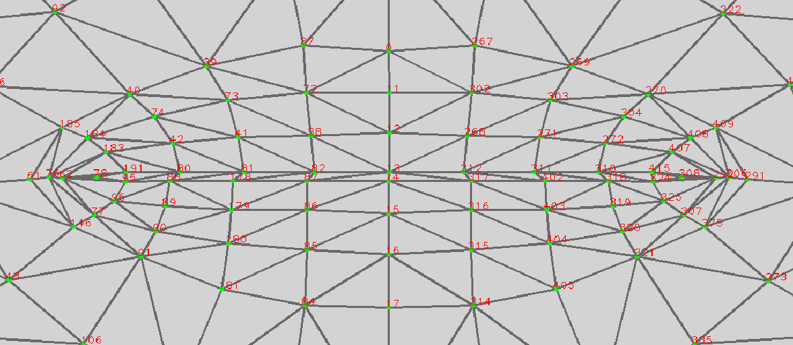

# Mouse Cursor Movement and Control using Eye Gaze- A Human Computer Interaction

After considering various input forms, such as eye detection situation, system on-off process using mouth, left click and right click using eyes. We prepared the visual results to observe proposed system’s performances.

    
<table>
    <thead>
        <tr>
            <th colspan=3> System turning on </th>
        </tr>
    </thead>
    <tbody>
        <tr>
            <td></td>
            <td></td>
            <td></td>
        </tr>
    </tbody>
</table>

<table>
    <thead>
        <tr>
            <th colspan=3> Left click and Right click </th>
        </tr>
    </thead>
    <tbody>
        <tr>
            <td></td>
            <td></td>
        </tr>
    </tbody>
</table>
<table>
    <thead>
        <tr>
            <th colspan=3> System turning off </th>
        </tr>
    </thead>
    <tbody>
        <tr>
            <td></td>
            <td></td>
            <td></td>
        </tr>
    </tbody>
</table>

## Landmark

The functionalities of the right click and left click
will be accessed through right eye winking and left
eye winking. For the left eye wink detection
landmark, 145,159 was used , and for
the right eye wink detection landmark, 386,374 was
used.

    
<table>
    <thead>
        <tr>
            <th colspan=3> Landmark </th>
        </tr>
    </thead>
    <tbody>
        <tr>
            <td></td>
            <td></td>
            <td></td>
        </tr>
    </tbody>
</table>
